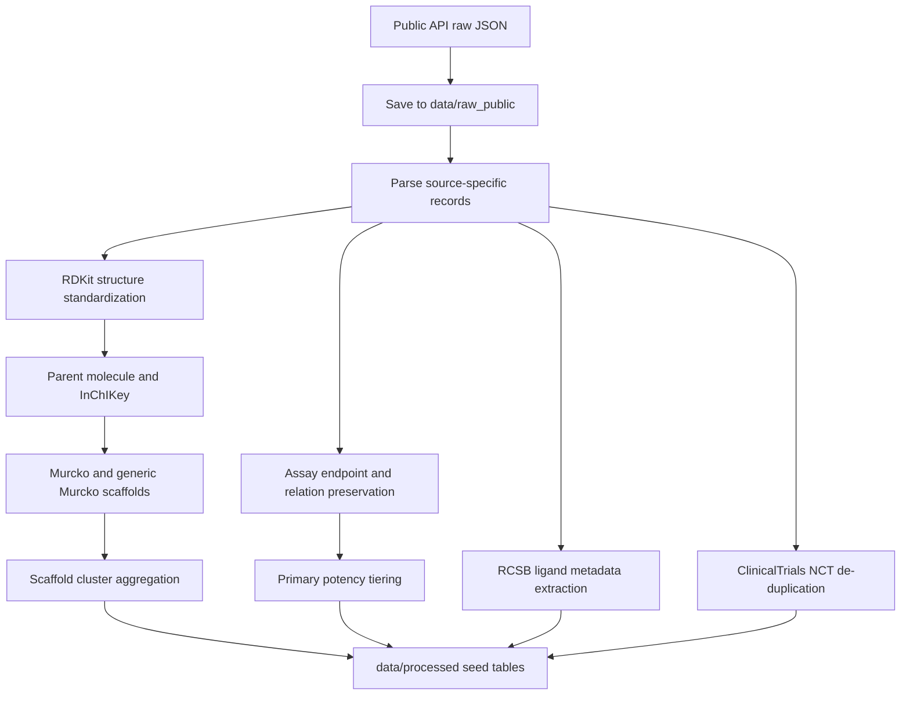

# FXIa 数据收集与生成模型交接说明

生成日期：2026-07-06

本文档说明本项目第一轮 FXIa scaffold atlas seed 数据是如何收集、处理和组织的，以及这些数据后续如何进入 LibInvent、Mol2Mol、LinkInvent 和 REINVENT 分子生成流程。当前数据集是“可追溯 seed 数据底座”，不是最终 scaffold 排名、专利突破结论或自由实施意见。

## 技术摘要

本轮数据收集围绕人源 coagulation Factor XI / FXIa / F11，ChEMBL target `CHEMBL2820`，UniProt `P03951` 展开。已落地的公开数据包括 ChEMBL 活性记录、PubChem/ChEMBL 临床代表分子标识符、ClinicalTrials.gov 试验状态、以及 RCSB PDB 结构和非聚合配体 metadata。

处理后的核心输出位于 `data/processed/`：

| 文件 | 行数 | 作用 |
| --- | ---: | --- |
| `fxia_molecule_seed.csv` | 13,303 | 分子级活性、结构、来源和 assay context 底表 |
| `fxia_scaffold_seed.csv` | 1,668 | RDKit Murcko scaffold 聚类底表 |
| `fxia_pdb_ids_seed.csv` | 114 | ChEMBL 目标交叉引用的 FXIa PDB ID 列表 |
| `fxia_pdb_interactions_seed.csv` | 272 | RCSB ligand/entity metadata seed 表 |
| `fxia_clinical_trials_seed.csv` | 34 | Asundexian / Milvexian 相关 ClinicalTrials.gov 记录 |
| `fxia_seed_summary.json` | 1 | 本轮数据收集计数摘要 |

这些表的直接用途是支持后续 scaffold review、SAR/patent/PDB 证据补全、生成输入包构建和模型校准。所有结构和活性值均保留来源字段；所有未验证的选择性、PDB 接触、专利和合成判断均保留为 `needs_verification` 或 `hold_for_more_data`。

## 正式脚本入口

当前仓库只保留可复现流程入口。临时补跑、一次性排障和结果目录下自动生成的命令文件不作为长期维护接口。

| 脚本 | 作用 | 典型命令 |
| --- | --- | --- |
| `scripts/data/build_fxia_seed_tables.py` | 从 `data/raw_public/` 构建 FXIa molecule/scaffold/PDB/clinical processed seed tables。 | `mamba run -n aidd python scripts/data/build_fxia_seed_tables.py` |
| `scripts/generation/prepare_reinvent4_inputs.py` | 从 `data/processed/fxia_molecule_seed.csv` 和 scaffold seed 表生成 REINVENT4 pilot/scale 输入、相似度排除集和 manifest。 | `mamba run -n aidd python scripts/generation/prepare_reinvent4_inputs.py --output-dir results/reinvent4_fxia_pilot` |
| `scripts/generation/run_reinvent4_scaleup.sh` | 启动或续跑 REINVENT4 scale-up 采样任务；会跳过日志中已有 `Finished REINVENT` 的路径。 | `mamba run -n aidd bash scripts/generation/run_reinvent4_scaleup.sh` |
| `scripts/filtering/filter_generated_molecules.py` | 对 REINVENT4 输出做 RDKit 标准化、类药规则过滤、clinical similarity 和 patent-proxy similarity 过滤。 | `mamba run -n aidd python scripts/filtering/filter_generated_molecules.py --input <raw.csv> --manifest results/reinvent4_fxia_pilot/generation_input_manifest.json --output-dir <filtered_dir>` |
| `scripts/filtering/merge_generation_candidates.py` | 合并多路 filtered outputs，按 parent InChIKey 去重，生成统一候选池。 | `mamba run -n aidd python scripts/filtering/merge_generation_candidates.py --input mol2mol=<filtered.csv> --output results/candidates/fxia_generation_pool_filtered.csv` |

## 数据从哪里来

### ChEMBL

来源：

- Target search：`https://www.ebi.ac.uk/chembl/api/data/target/search.json?q=Factor%20XIa`
- Activity API：`https://www.ebi.ac.uk/chembl/api/data/activity.json?target_chembl_id=CHEMBL2820`
- Molecule search/detail API：用于 asundexian 与 milvexian 的 ChEMBL 记录确认
- 浏览入口：`https://www.ebi.ac.uk/chembl/target_report_card/CHEMBL2820/`

收集内容：

- 人源 FXI/FXIa 目标定义：`CHEMBL2820`、UniProt `P03951`、gene symbol `F11`
- 13,301 条 ChEMBL FXIa activity rows
- 结构字段：ChEMBL molecule ID、canonical SMILES、RDKit InChIKey、parent InChIKey
- 活性字段：endpoint type、value、unit、relation、p_activity、assay type、assay description、species、activity source URL

ChEMBL 活性端点在本轮 seed 表中不被合并。当前主要 endpoint 分布为：

| endpoint | 行数 |
| --- | ---: |
| `kon` | 3,765 |
| `k_off` | 3,765 |
| `IC50` | 3,364 |
| `Ki` | 2,113 |
| `Inhibition` | 163 |
| `Kd` | 9 |

其中 `Ki`、`IC50`、`Kd` 共 5,486 行；用于 scaffold tier 初筛的记录进一步限定为 nM 单位且 relation 为 `=`、`<` 或 `<=`，共 5,140 行。`kon`、`k_off`、`Inhibition` 等记录保留在分子底表中，但不会用于 potency tier 评分。

### PubChem 与 ChEMBL 代表分子

来源：

- Asundexian PubChem CID `135206011`：`https://pubchem.ncbi.nlm.nih.gov/compound/135206011`
- Milvexian PubChem CID `118277544`：`https://pubchem.ncbi.nlm.nih.gov/compound/118277544`
- ChEMBL asundexian search/detail
- ChEMBL milvexian search/detail

收集内容：

- Asundexian / BAY 2433334：SMILES、InChIKey、PubChem CID、ChEMBL ID
- Milvexian / BMS-986177 / JNJ-70033093：SMILES、InChIKey、PubChem CID、ChEMBL ID

用途：

- 作为临床候选 chemotype anchor 和模型校准 positive reference
- 用于 similarity exclusion set，避免生成直接贴近临床候选 scaffold
- 用于 patent crowding 标注的优先审阅对象

注意：这两个代表分子在本轮表中不是直接设计模板。按照项目规则，它们应被视为 `crowded_anchor`，主要用于药效团学习、相似度排除和模型校准。

### ClinicalTrials.gov

来源：

- `https://clinicaltrials.gov/api/v2/studies?query.term=asundexian`
- `https://clinicaltrials.gov/api/v2/studies?query.term=BAY%202433334`
- `https://clinicaltrials.gov/api/v2/studies?query.term=milvexian`
- `https://clinicaltrials.gov/api/v2/studies?query.term=BMS-986177`

收集内容：

- NCT ID
- query term
- representative molecule
- brief title
- overall status
- phase
- start date
- completion date
- interventions
- ClinicalTrials.gov source URL

去重后共有 34 条临床试验记录：

| molecule | 记录数 |
| --- | ---: |
| Milvexian | 26 |
| Asundexian | 8 |

试验状态分布：

| overall status | 记录数 |
| --- | ---: |
| `COMPLETED` | 30 |
| `ACTIVE_NOT_RECRUITING` | 2 |
| `TERMINATED` | 1 |
| `RECRUITING` | 1 |

用途：

- 记录临床候选分子的公开研发状态和适应症背景
- 帮助区分“临床候选 anchor”和“可探索 scaffold”
- 支持后续报告中的 status/date claim 审计

注意：ClinicalTrials.gov 状态是时间敏感信息。任何最终报告或对外材料都应在使用前重新拉取或人工核对。

### RCSB PDB

来源：

- ChEMBL target `CHEMBL2820` 中的 PDB cross-reference
- RCSB core entry API：`https://data.rcsb.org/rest/v1/core/entry/{pdb_id}`
- RCSB nonpolymer entity API：`https://data.rcsb.org/rest/v1/core/nonpolymer_entity/{pdb_id}/{entity_id}`
- RCSB chemcomp API：`https://data.rcsb.org/rest/v1/core/chemcomp/{ligand_id}`
- 浏览入口：`https://www.rcsb.org/structure/{pdb_id}`

收集内容：

- 114 个与 ChEMBL FXIa target 关联的 PDB ID
- entry title、resolution、primary citation DOI
- non-polymer entity ID
- ligand ID、ligand name、ligand SMILES、chem_comp type
- RCSB structure URL

`fxia_pdb_interactions_seed.csv` 包含 272 条 non-polymer ligand/entity metadata 行，覆盖 109 个带 non-polymer entity 的 PDB entry 和 111 个唯一 ligand ID。常见 ligand/entity 包括 `SO4`、`EDO`、`CIT`、`GOL`、`NAG`、`BEN` 等；这些实体并不都代表 FXIa 抑制剂，因此不能仅凭 ligand 出现在 PDB 中就推断其药效或可设计价值。

用途：

- 建立可追溯的 FXIa 结构入口
- 为后续 PLIP、ProLIF、PoseBusters、手工结构审阅或 docking 准备 PDB/ligand 列表
- 支持药效团约束、S1/S2/S4 pocket 占据、solvent-front exit vector 和选择性 residue 证据补全

注意：当前 PDB 表是 metadata seed。`binding_site_region`、`s1_occupancy`、`s2_s4_occupancy`、`key_residue_contacts`、`water_mediated_contacts` 均为 `needs_verification`，尚未做真实相互作用提取。

## 每张表包含哪些指标

### `fxia_molecule_seed.csv`

这是分子级底表，主要服务于活性筛选、结构标准化、去重和生成模型 reference set 构建。

关键字段：

| 字段 | 含义 |
| --- | --- |
| `molecule_id` | ChEMBL ID 或代表分子 ID |
| `source` | 数据来源，例如 ChEMBL、PubChem |
| `source_record_id` | 可追溯来源记录，例如 ChEMBL activity ID、PubChem CID |
| `canonical_smiles` | RDKit canonical SMILES |
| `inchi_key` | 原始结构 InChIKey |
| `parent_inchi_key` | 盐剥离/母体结构 InChIKey |
| `stereochemistry_defined` | RDKit 是否识别到定义明确的手性中心 |
| `salt_stripped` | 标准化时是否剥离了盐/小片段 |
| `activity_type` | `Ki`、`IC50`、`Kd`、`kon`、`k_off` 等端点 |
| `activity_value` | 活性数值，按来源保留 |
| `activity_unit` | 活性单位，按来源保留 |
| `activity_relation` | `=`、`<`、`<=`、`>` 等关系符 |
| `p_activity` | 对可换算浓度端点计算的 pActivity |
| `assay_type` | ChEMBL assay type |
| `assay_description` | assay 描述和条件文本 |
| `species` | target organism |
| `selectivity_*` | 选择性字段，当前待补 |
| `functional_aptt` / `functional_pt` | 功能性凝血 readout，当前待补 |
| `source_url` | 原始来源 URL |
| `confidence` | 当前来源可信度标记 |
| `notes` | 处理说明或未评分原因 |

原则：

- 不合并不同 assay 的 `Ki`、`IC50`、`Kd`
- 不把 biochemical FXIa potency 和 aPTT/PT 功能 readout 混在一起
- 非 primary potency endpoint 保留，但不用于 scaffold potency tier

### `fxia_scaffold_seed.csv`

这是 scaffold 聚类底表，用于后续 scaffold atlas 和 first-round generation scaffold shortlist 的初筛。

关键字段：

| 字段 | 含义 |
| --- | --- |
| `scaffold_id` | 自动分配的 scaffold cluster ID |
| `murcko_smiles` | RDKit Bemis-Murcko scaffold |
| `generic_murcko_smiles` | RDKit generic Murcko scaffold |
| `representative_molecules` | 每个 cluster 的代表 ChEMBL molecule ID |
| `best_fxia_activity` | 该 scaffold cluster 内 primary nM endpoint 的最佳值 |
| `median_fxia_activity` | 该 scaffold cluster 内 primary nM endpoint 的中位值 |
| `activity_tier` | 活性证据 tier |
| `sar_depth` | cluster analog 深度提示 |
| `patent_crowding` | 当前为 `needs_patent_review` |
| `generation_suitability` | 当前为 `needs_verification` |
| `decision` | 当前统一为 `hold_for_more_data` |
| `notes` | cluster assay row 数和 unique parent InChIKey 数 |

activity tier 规则：

| tier | 当前脚本规则 |
| --- | --- |
| `Tier A` | 至少 2 个 unique parent compound，且 best nM potency <= 10 nM |
| `Tier B` | 至少 2 个 unique parent compound，且 best nM potency <= 100 nM |
| `Tier C` | 至少 1 个 primary nM potency <= 1 uM |
| `Tier D` | 未达到以上条件、无可评分 primary nM endpoint 或仅弱/不确定证据 |

当前 scaffold tier 分布：

| tier | scaffold 数 |
| --- | ---: |
| `Tier A` | 314 |
| `Tier B` | 105 |
| `Tier C` | 828 |
| `Tier D` | 421 |

注意：该 tier 只是 activity seed signal，不等价于优先级排序。最终 `priority_score` 还需要选择性、PDB 结合模式、专利空间、合成可行性和生成适配性。

### `fxia_pdb_interactions_seed.csv`

这是 PDB ligand metadata seed 表，不是最终相互作用表。

关键字段：

| 字段 | 含义 |
| --- | --- |
| `pdb_id` | RCSB PDB ID |
| `ligand_id` | RCSB chemcomp ID |
| `ligand_name` | ligand/entity 名称 |
| `ligand_smiles` | RCSB chemcomp SMILES |
| `resolution` | 结构分辨率 |
| `protein_species` | 当前由 CHEMBL2820/P03951 交叉引用推断为人源 |
| `binding_site_region` | 待结构相互作用解析 |
| `s1_occupancy` | 待结构相互作用解析 |
| `s2_s4_occupancy` | 待结构相互作用解析 |
| `solvent_front_exit_vector` | 待结构相互作用解析 |
| `key_residue_contacts` | 待结构相互作用解析 |
| `water_mediated_contacts` | 待结构相互作用解析 |
| `pose_quality_notes` | metadata 层面的说明 |
| `source_url` | RCSB 结构入口 |
| `doi` | RCSB primary citation DOI |

下一步应对该表增加：

- ligand 是否为真实 active-site inhibitor
- S1/S1'/S2/S4 pocket occupancy
- catalytic triad 附近关系
- 与 FXa、thrombin、kallikrein、trypsin-like proteases 的 selectivity-relevant contacts
- 水介导相互作用和 pose quality

### `fxia_clinical_trials_seed.csv`

这是临床候选 anchor 的公开状态表。

关键字段：

| 字段 | 含义 |
| --- | --- |
| `nct_id` | ClinicalTrials.gov study ID |
| `query_term` | 命中的搜索词 |
| `representative_molecule` | Asundexian 或 Milvexian |
| `brief_title` | 试验标题 |
| `overall_status` | ClinicalTrials.gov 当前记录状态 |
| `phase` | 试验 phase |
| `start_date` | 开始日期 |
| `completion_date` | 完成日期 |
| `interventions` | 干预药物/对照 |
| `source_url` | ClinicalTrials.gov study URL |
| `confidence` | 数据来源可信度 |
| `notes` | 使用前需复核的说明 |

用途：

- 识别临床候选 scaffold 的 patent/status crowding
- 给模型 calibration reference 设置“仅参考、不直接生成”的边界
- 支持后续技术报告中对 status/date 的可追溯引用

## 数据经过了哪些处理

核心数据收集脚本：

- `scripts/data/build_fxia_seed_tables.py`

运行环境：

- `mamba run -n aidd python scripts/data/build_fxia_seed_tables.py`
- `aidd` 环境中包含 RDKit

处理流程：



### 原始数据保存

所有 API 返回先保存到 `data/raw_public/`，再解析成 `data/processed/`。这样可以在不重复联网的情况下重新构建 seed 表，也方便审计每个字段来自哪个公共数据库。

主要 raw data 类型：

- `chembl_fxia_activities_page*.json`
- `chembl_target_factor_xia_search.json`
- `pubchem_asundexian_properties.json`
- `pubchem_milvexian_properties.json`
- `clinicaltrials_*.json`
- `rcsb_entries/*.json`
- `rcsb_nonpolymer/*.json`
- `rcsb_chemcomp/*.json`

### 结构标准化

对每条有 SMILES 的记录执行：

1. RDKit 读取 SMILES。
2. 生成 isomeric canonical SMILES。
3. 生成原始结构 InChIKey。
4. 使用 `rdMolStandardize.FragmentParent` 提取 parent molecule。
5. 对 parent molecule 初始化 property cache 和 ring info。
6. 生成 parent InChIKey。
7. 标记 `salt_stripped`。
8. 标记 `stereochemistry_defined`。
9. 生成 Bemis-Murcko scaffold。
10. 生成 generic Murcko scaffold。

这样做的目的：

- 用 parent InChIKey 做去重和 scaffold analog depth 统计
- 避免盐、配对离子、小片段影响 scaffold 聚类
- 保留 stereochemistry metadata，避免把手性临床候选误当作无手性结构
- 为 LibInvent/Mol2Mol/LinkInvent 准备结构一致的输入

### 活性数据处理

活性处理遵循以下规则：

- 保留 assay row，不按 molecule 或 scaffold 强行合并不同 assay。
- 保留 `activity_type`、`activity_value`、`activity_unit`、`activity_relation`。
- 只在单位可换算时计算 `p_activity`。
- scaffold tier 只使用 `Ki`、`IC50`、`Kd` 三类 primary potency endpoint。
- scaffold tier 只使用 nM 单位且 relation 为 `=`、`<`、`<=` 的记录。
- `kon`、`k_off`、`Inhibition`、`Activity`、`EC50` 等记录保留，但标注为不参与 scaffold potency tier。

这样做的目的：

- 防止把不同机制或不同 assay readout 混为一个 potency 数字。
- 保留 kinetics 数据供后续人工判断，但不让它污染 IC50/Ki/Kd tier。
- 避免把 `>` 这类弱活性边界当成强活性证据。

### Scaffold 聚类处理

scaffold 聚类使用 RDKit Murcko scaffold 作为第一层 grouping key。

每个 scaffold cluster 汇总：

- 代表 molecule ID
- best FXIa primary nM activity
- median FXIa primary nM activity
- activity tier
- assay row 数
- unique parent InChIKey 数
- SAR depth 初步标记

当前所有 scaffold 的 `decision` 都保持为 `hold_for_more_data`。原因是：

- 选择性证据尚未系统抽取。
- PDB 接触和 pocket occupancy 尚未解析。
- 专利 crowding 尚未完成。
- 合成可行性尚未由药化审阅。
- generation suitability 尚未按 exit vector 和模板可用性评估。

### PDB metadata 处理

PDB 处理分为三层：

1. 从 ChEMBL target cross-reference 获取 PDB ID。
2. 从 RCSB entry API 获取 resolution、DOI、non-polymer entity IDs。
3. 从 RCSB nonpolymer 和 chemcomp API 获取 ligand ID、name、SMILES 和 chem_comp type。

当前不做自动 pocket annotation。后续如果接入 PLIP、ProLIF 或结构审阅，应把结果回填到：

- `binding_site_region`
- `s1_occupancy`
- `s2_s4_occupancy`
- `solvent_front_exit_vector`
- `key_residue_contacts`
- `water_mediated_contacts`
- `pose_quality_notes`

## 这些数据有什么作用

### 对 scaffold atlas 的作用

当前数据能回答：

- 哪些公开 ChEMBL 分子在 FXIa/F11 上有活性记录？
- 哪些 Murcko scaffold 在公开数据中有多个 analog？
- 哪些 scaffold 有 nM 级 biochemical potency seed signal？
- 哪些 PDB entry 可作为结构审阅入口？
- Asundexian 和 Milvexian 应作为哪些 crowded clinical anchors？

当前数据不能直接回答：

- 哪个 scaffold 具备真实 patent white space？
- 哪个 scaffold 对 FXa/thrombin/kallikrein 等 off-target 选择性最好？
- 哪个 PDB ligand 真实占据 S1/S4 pocket？
- 哪个 scaffold 可直接进入 first-round synthesis？
- 哪个 scaffold 已经满足最终 `advance_primary` 标准？

### 对药化和专利审阅的作用

药化团队可以用 `fxia_scaffold_seed.csv` 按以下方式初筛：

1. 优先查看 `Tier A` 和 `Tier B` scaffold cluster。
2. 检查 `representative_molecules` 对应的 ChEMBL assay context。
3. 回到 `fxia_molecule_seed.csv` 查看 assay description、relation 和 source URL。
4. 对 candidate cluster 补充选择性、文献 SAR 和专利例子。
5. 标注 scaffold 的 key exit vectors、known liabilities 和 synthesis risk。

专利团队可以用代表 molecule、Murcko scaffold 和 clinical anchor InChIKey 做：

- clinical candidate similarity review
- patent example proximity review
- Markush core overlap review
- broad claim risk review

文档中不应使用“free to operate”结论。只能使用 `high patent crowding`、`moderate patent crowding`、`possible white space`、`requires patent counsel review` 等技术风险语言。

## 如何送到分子生成模型

当前 seed 表不能直接全量送入生成模型。推荐先构建一个明确的 generation input package。

### 生成前的筛选步骤

1. 从 `fxia_scaffold_seed.csv` 选择候选 scaffold。
2. 只把 activity tier 当作初筛信号，不作为最终优先级。
3. 对候选 scaffold 补齐：
   - representative molecule canonical SMILES
   - selectivity evidence
   - PDB binding mode evidence
   - patent crowding level
   - key exit vectors
   - forbidden substructures
   - similarity exclusion set
4. 标记每个 scaffold 的 generation method：
   - `LibInvent`
   - `Mol2Mol`
   - `LinkInvent`
   - `REINVENT de novo`
5. 生成 `generation_input_package.csv` 或 `generation_input_package.json`。

推荐字段：

| 字段 | 用途 |
| --- | --- |
| `scaffold_id` | 追溯到 scaffold seed 表 |
| `scaffold_smiles` | 生成核心或 scaffold template |
| `attachment_points` | LibInvent / LinkInvent 可修改位点 |
| `positive_reference_smiles` | 活性代表分子或药效团校准分子 |
| `negative_reference_smiles` | 低活性、选择性差或 patent-near neighbor 排除参考 |
| `required_pharmacophore_features` | S1/S4/S1' 等关键相互作用需求 |
| `forbidden_substructures` | amidine/basic liability、reactive alerts、clinical candidate exact cores 等 |
| `similarity_exclusion_set` | asundexian、milvexian、patent examples 等 |
| `recommended_method` | 该 scaffold 推荐生成方法 |
| `property_filters` | MW、cLogP、TPSA、HBD/HBA、rotatable bonds、charge、SA score |
| `source_evidence` | ChEMBL/PDB/patent/SAR 来源引用 |

### LibInvent

适合场景：

- 已确定核心 scaffold 和 1-3 个可替换 attachment points。
- 希望保留核心结合模式，同时系统枚举取代基。

输入来源：

- `fxia_scaffold_seed.csv` 的 `murcko_smiles`
- 人工标注后的 `attachment_points`
- `fxia_molecule_seed.csv` 中同 cluster 的活性代表分子

交接方式：

- 将 scaffold template 转为带 attachment point 的 SMILES，例如 `[*:1]...[*:2]`。
- 使用 `positive_reference_smiles` 保持已知 FXIa pharmacophore。
- 使用 `similarity_exclusion_set` 排除 asundexian/milvexian 直接近邻。

### Mol2Mol

适合场景：

- 已有高质量 active representative，希望做局部结构变换。
- 目标是探索同 scaffold 或相邻 scaffold 的 analog space。

输入来源：

- `fxia_molecule_seed.csv` 中 primary endpoint 强、assay context 明确的 molecule SMILES。
- 选择性或专利风险较低的候选，而不是临床候选直接 analog。

交接方式：

- 输入 curated active SMILES。
- 设置 ECFP4 similarity window，例如避免对 clinical candidates > 0.45。
- 对 patent examples 设置更严格排除，例如 > 0.50 的近邻进入 reject 或 deprioritize。

### LinkInvent

适合场景：

- PDB 或 SAR 支持两个 pharmacophore 片段分别占据 S1 和 S2/S4 或 S1/S1'。
- 需要系统探索 linker，而不是整体 scaffold 替换。

输入来源：

- `fxia_pdb_interactions_seed.csv` 后续补全的 binding mode。
- 药化审阅确认的片段对。

交接方式：

- 输入 fragment A、fragment B 和 linker constraints。
- 明确 linker 长度、几何约束、极性限制和 forbidden motifs。
- docking/pharmacophore 过滤应检查 S1/S4 pocket engagement。

### REINVENT de novo

适合场景：

- 需要跳出已知 crowded scaffold。
- 已有清晰 scoring function 和过滤条件。

输入来源：

- 从 scaffold atlas 中筛出的 pharmacophore features。
- 选择性反筛目标、PDB docking receptor、property filters。

交接方式：

- scoring components 应包含：
  - FXIa docking 或 pharmacophore score
  - similarity exclusion to clinical candidates and patent examples
  - physchem filters
  - PAINS/reactive/toxicophore alerts
  - SA score
  - selectivity counter-screen score when available

## 推荐的生成前质量门槛

一个 scaffold 进入 first-round generation 前，至少应满足：

- 有明确 `scaffold_id` 和 `scaffold_smiles`。
- 至少一个 source-backed FXIa activity reason。
- 活性 endpoint、单位、relation、assay context 可追溯。
- 选择性风险被显式写出，即使是 `missing_selectivity_data`。
- patent crowding 经过初步审阅，不把 clinical candidate scaffold 当直接模板。
- PDB/binding-mode evidence 明确是已验证、推断还是缺失。
- 有明确 key exit vectors 或 fragment/linker design rationale。
- 有 similarity exclusion set。
- 有 forbidden substructures。
- 有 generation method 和 property filters。

## 当前缺口

`missing_activity_data`：

- BindingDB 尚未接入。
- 文献 SAR 表尚未结构化抽取。
- ChEMBL document DOI 尚未批量展开。

`missing_selectivity_data`：

- FXa、thrombin/FIIa、kallikrein、trypsin、plasmin、FIXa、FVIIa counter-screen 尚未系统收集。

`missing_pdb_evidence`：

- 当前只有 RCSB metadata。
- 尚未做 ligand-protein contacts、S1/S2/S4 occupancy、水介导相互作用和 pose quality。

`missing_patent_review`：

- 尚未收集 patent family、publication number、priority date、assignee、Markush core、example potency。
- 当前 clinical anchors 仅应标为 crowded anchors。

`missing_synthesis_route`：

- 未评估 building block availability、route length、stereochemistry risk、macrocycle/constrained scaffold risk。

## 可重复运行方式

在 `aidd` 环境中重新生成 processed seed 表：

```bash
mamba run -n aidd python scripts/data/build_fxia_seed_tables.py
```

脚本读取：

- `data/raw_public/`

脚本写出：

- `data/processed/fxia_molecule_seed.csv`
- `data/processed/fxia_scaffold_seed.csv`
- `data/processed/fxia_pdb_ids_seed.csv`
- `data/processed/fxia_pdb_interactions_seed.csv`
- `data/processed/fxia_clinical_trials_seed.csv`
- `data/processed/fxia_seed_summary.json`

如需更新到最新公共数据库状态，应先重新拉取 ChEMBL、PubChem、ClinicalTrials.gov 和 RCSB 原始 API 数据，再运行脚本。任何临床状态、专利状态或数据库记录数都可能随时间变化，最终交付前必须复核。
